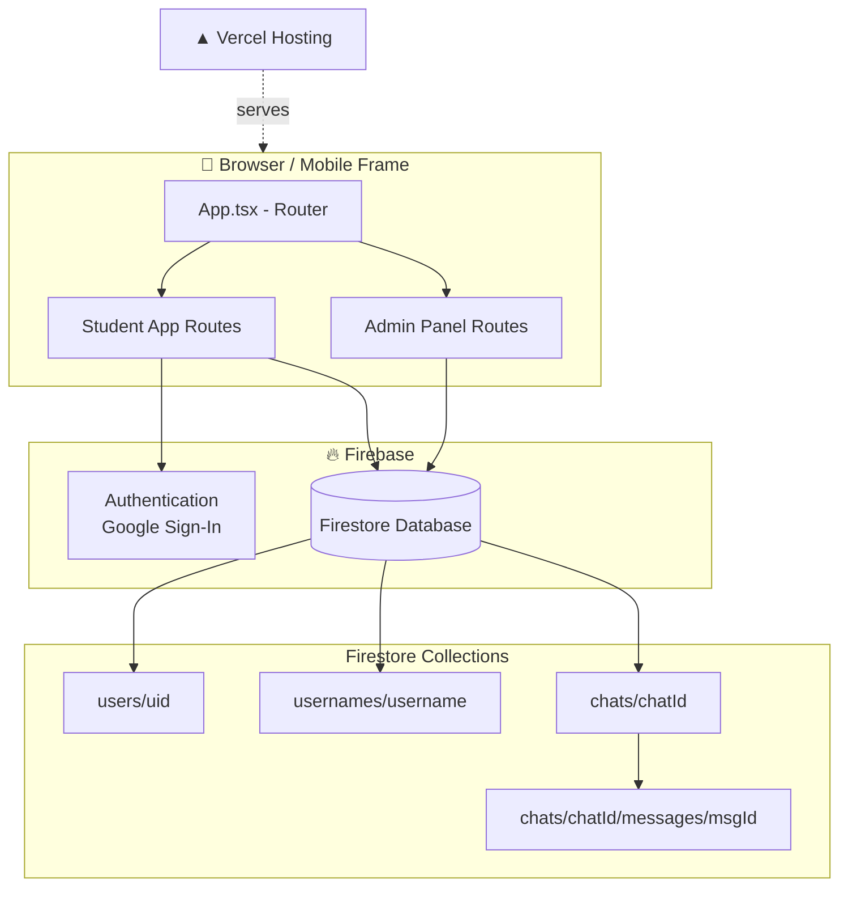

# 📍 PROJECT MAP — School (Exam Prep App)

> **Yeh file kis liye hai:** Is poore project ko samajhne ke liye. Agar kabhi kisi AI
> assistant (ya khud tumhe) se help chahiye, to sabse pehle sirf yeh file dikhao —
> poora `src` folder padhne ki zaroorat nahi padegi.
>
> Last updated: is file ko banane wale session me jo bhi changes hue, wo "Change Log"
> section me niche likhe hain. Naya kaam karne ke baad is file ko bhi update karte rehna.

---

## 1. Project kya hai

Ek React + TypeScript + Vite based **exam preparation app** (school students ke liye),
Firebase (Auth + Firestore) backend ke saath, Vercel par deployed.

- **Framework:** React 18 + Vite + TypeScript
- **Styling:** Tailwind CSS v4 (utility classes) + custom dark theme system
- **Animations:** Framer Motion
- **Icons:** lucide-react
- **Backend:** Firebase Authentication (Google Sign-In) + Cloud Firestore
- **Hosting:** Vercel (production domain: `school-kohl-three.vercel.app`)
- **AI features:** `@google/genai` dependency hai (Gemini API ke liye), abhi kis feature
  me use ho raha hai — check `GEMINI_API_KEY` in `.env.example`.

---

## 2. High-level architecture



---

## 3. Folder / File map (kya kaam karta hai)

```
src/
├── App.tsx                    # Saara routing yahin define hai (React Router)
├── main.tsx                   # Entry point, App ko DOM me mount karta hai
├── index.css                  # Tailwind + custom dark-theme CSS overrides (IMPORTANT — section 6 padho)
│
├── context/
│   └── AuthContext.tsx        # useAuth() hook. Firebase Auth state + Firestore
│                               # 'users/{uid}' doc ko real-time sunta hai (onSnapshot)
│
├── lib/
│   ├── firebase.ts            # Firebase config + app/auth/db initialize
│   └── chat.ts                # Chat ke saare Firestore helper functions
│                               # (getChatId, sendMessage, subscribeToChats, etc.)
│
├── types/
│   └── models.ts               # TypeScript interfaces: User, Subject, Chapter, Topic
│
├── data/
│   └── mockData.ts             # ⚠️ HARDCODED practice questions + subjects list
│                               # (abhi tak Firestore se nahi aata — section 7 dekho)
│
├── services/
│   └── pointsService.ts        # Test complete karne par points/streak calculate karta hai
│                               # (client-side hai, comment me khud likha hai ki ideally
│                               #  Cloud Function me hona chahiye taaki koi cheat na kare)
│
├── components/                 # Reusable UI pieces
│   ├── MobileFrame.tsx          # Student app ko phone-jaisa frame me wrap karta hai
│   ├── BottomNavBar.tsx         # Neeche wali navigation bar
│   ├── BlobCharacter.tsx        # Mascot/emoji-jaisa illustrated character
│   ├── ListActionCard.tsx       # Practice list items ke liye reusable card
│   ├── DateBadgeRow.tsx         # Home page par week ke din dikhane wali row
│   ├── SegmentedToggle.tsx      # Tab-jaisa toggle switch (Leaderboard me use hota hai)
│   └── charts/
│       ├── MiniBarChart.tsx     # Chhota bar chart (analytics ke liye)
│       └── SparklineChart.tsx   # Chhota line/trend chart
│
└── pages/
    ├── Login.tsx                # Email/Google login
    ├── Register.tsx             # Naya account banane ka page (username + profile setup)
    ├── Home.tsx                 # Dashboard — "Today's Goals" etc.
    │
    ├── practice/
    │   ├── PracticeLists.tsx    # Subjects/Chapters/Topics list (⚠️ mockData use karta hai)
    │   ├── MCQEngine.tsx        # Practice mode me questions solve karna (⚠️ mockData)
    │   ├── WeakTopics.tsx       # Weak topics list
    │   └── Bookmarks.tsx        # Bookmark kiye hue questions
    │
    ├── test/
    │   ├── TestEngine.tsx       # Timed test lena (⚠️ mockData se questions leta hai)
    │   └── TestResult.tsx       # Test ka result/breakdown dikhata hai
    │
    ├── daily/
    │   └── DailyChallenge.tsx   # Roz ka ek chhota challenge
    │
    ├── leaderboard/
    │   └── Leaderboard.tsx      # ⚠️ HARDCODED "mockLeaderboard" array — real users nahi
    │
    ├── analytics/
    │   └── PerformanceAnalytics.tsx  # Charts/stats page
    │
    ├── profile/
    │   ├── Profile.tsx          # User profile + badges (⚠️ badges hardcoded array)
    │   └── Settings.tsx         # Dark mode toggle, logout, account delete
    │
    ├── chat/
    │   ├── ChatList.tsx         # ✅ REAL — Firestore se live chat list (username se dhoondo)
    │   └── Chat.tsx             # ✅ REAL — real-time messaging (Firestore onSnapshot)
    │
    ├── notifications/
    │   └── Notifications.tsx    # Notifications list (abhi static array hai)
    │
    └── admin/
        ├── AdminLayout.tsx      # Admin panel ka sidebar+header wrapper (web/desktop target)
        ├── AdminDashboard.tsx   # ⚠️ HARDCODED stats (Total Students: 1,248 etc — fake numbers)
        ├── AdminStudents.tsx    # ⚠️ HARDCODED "MOCK_STUDENTS" list
        └── AdminMCQ.tsx         # Question bank management (⚠️ mockData se)
```

---

## 4. Routing map (App.tsx)

| Path | Component | Kiske liye |
|---|---|---|
| `/login`, `/register` | Login, Register | Public |
| `/` | Home | Protected (login zaroori) |
| `/practice`, `/practice/subject/:id`, `/practice/chapter/:id` | PracticeLists | Protected |
| `/practice/topic/:id/mcq` | MCQEngine | Protected |
| `/test/active`, `/test/result` | TestEngine, TestResult | Protected |
| `/daily` | DailyChallenge | Protected |
| `/leaderboard` | Leaderboard | Protected |
| `/profile`, `/settings` | Profile, Settings | Protected |
| `/chat` | ChatList | Protected |
| `/chat/:userId` | ChatRoom (Chat.tsx) | Protected — `:userId` = doosre user ka uid |
| `/notifications` | Notifications | Protected |
| `/admin`, `/admin/students`, `/admin/mcq` | AdminLayout + children | Alag layout (sidebar wala, web ke liye) |

`ProtectedRoute` wrapper — agar `useAuth().user` null hai to `/login` par redirect kar deta hai.

---

## 5. Firestore Data Model

### `users/{uid}`
```
{
  uid, name, username, mobile, email, class, board, subjects[],
  profilePic, totalPoints, rank, questionsAttempted, testsCompleted,
  correctAnswers, accuracy, badges[], streak, status: 'active'|'suspended'|'blocked'
}
```
Naya user banate waqt yeh saari fields dena zaroori hai (rules me `hasAll` check hai),
`totalPoints` shuru me 0 aur `status` 'active' hona chahiye.

### `usernames/{username}`
```
{ uid }
```
Sirf unique-username check ke liye — registration ke time reserve hota hai.

### `chats/{chatId}`  — chatId = `[uid1, uid2].sort().join('_')`
```
{
  participants: [uid1, uid2],           // sorted array
  participantInfo: { [uid]: {name, username} },
  lastMessage: string,
  lastMessageAt: timestamp,
  unread: { [uid]: number }
}
```

### `chats/{chatId}/messages/{messageId}`
```
{ text, senderId, createdAt }
```

**Rules ka pattern:** har collection me `isSignedIn()`, `isOwner()`, `incoming()`/`existing()`
helper functions use hote hain. Global fallback `{document=**} { allow read, write: if false }`
hai — matlab kisi bhi naye collection ke liye explicit rule likhni hi padegi, warna
"Missing or insufficient permissions" error aayega.

**⚠️ Yaad rakhna:** `firestore.rules` file sirf code repo me hone se kaam nahi karti —
Firebase Console → Firestore Database → Rules tab me paste karke **Publish** karna zaroori hai.

---

## 6. Dark Theme System (important gotcha)

Yeh app Tailwind ke built-in `dark:` variant use **nahi** karta. Iske bajaye ek manual
system hai:

- `Settings.tsx` me toggle karne par `<html>` tag par class `dark-theme` add/remove hoti hai
- `index.css` ke neeche ek **bahut bada override block** hai jo specific Tailwind classes
  (jaise `.bg-white`, `.text-gray-500`) ko dark-mode colors me map karta hai using `!important`

**🚨 SABSE BADA GOTCHA (isi wajah se pehle "text ghayab" wala bug aaya tha):**
`body { color: #1A1A1A }` explicitly set hai. Agar koi bhi heading/paragraph ke paas
**apna khud ka `text-black`/`text-gray-XXX` class nahi hai**, to wo hamesha body ka
dark color inherit karega — chahe background dark mode me kitna bhi black ho jaye,
text wahi purana dark hi rahega (invisible ho jayega).

**Rule of thumb jab bhi naya text/heading likho:**
👉 Hamesha explicit `text-black` (ya jo bhi color chahiye) class do, kabhi color
class chhodo mat, chahe woh "default text" jaisa lage.

Agar koi naya rang (background ya text) use karo jo ab tak list me nahi hai, to
`index.css` ke `html.dark-theme` wale block me uska bhi mapping add karna padega.

---

## 7. ⚠️ Abhi bhi HARDCODED/FAKE data (real karna baaki hai)

Yeh woh jagah hain jo abhi database se real data nahi le rahi — agar "yeh real nahi
lag raha" ki complaint aaye, to yahin dekhna:

| File | Kya hardcoded hai |
|---|---|
| `data/mockData.ts` | Practice/test ke saare **questions aur subjects** — ismein use hone wali `PracticeLists.tsx`, `MCQEngine.tsx`, `TestEngine.tsx`, `AdminMCQ.tsx` sab isi fake data par chal rahe hain |
| `pages/admin/AdminDashboard.tsx` | Stats cards (Total Students: 1,248 etc.) hardcoded numbers hain |
| `pages/admin/AdminStudents.tsx` | `MOCK_STUDENTS` — poori student list fake hai |
| `pages/profile/Profile.tsx` | Badges list ka `earned: true/false` hardcoded hai, actual achievement se link nahi hai |
| `pages/notifications/Notifications.tsx` | Notifications ka static array — koi real trigger/backend nahi |

✅ **Jo REAL ho chuka hai:** Login/Register (Firebase Auth), Home ka user data
(`useAuth()` se), Chat (poora Firestore-backed real-time), Profile ka top section
(name/points/streak — `useAuth()` se aata hai, sirf badges list hardcoded hai),
**Leaderboard (`pages/leaderboard/Leaderboard.tsx`) — ab real `users` collection
se `totalPoints` order me aata hai, `lib/leaderboard.ts` naya helper file hai.**

---

## 8. Deployment / Hosting

- **Vercel production URL:** `https://school-kohl-three.vercel.app/`
  (random deployment URLs jaise `xyz123.vercel.app` bhi banate hain per-push, unhe ignore karo)
- **`vercel.json`** — SPA rewrite config hai (`/(.*) → /index.html`), isi se
  `/login` jaisa route refresh karne par 404 nahi aata
- **Firebase Authorized Domains:** Authentication → Settings → Authorized domains me
  production domain add hona chahiye, warna Google Sign-In `auth/unauthorized-domain` error dega
- **Git branch:** sirf `main` use karo (koi `master` nahi — script khud rename kar deta hai agar mile)

---

## 9. Push/Deploy Script

`git.py` (project folder ke bahar, Termux me) — ek interactive tool jo:
1. Folder path poochta hai
2. Pehli baar GitHub username/token/naam/email poochta hai, phir `~/.git_push_config.json`
   me save kar deta hai (dobara nahi poochta)
3. Menu deta hai: Push / Ek file delete / Sab files delete
4. Push se pehle khud remote se pull-merge karta hai (taaki reject na ho)
5. Token kabhi screen par nahi dikhata

---

## 10. Change Log (is session me kya-kya fix hua)

- ✅ `vercel.json` add kiya (SPA routing 404 fix)
- ✅ Git branch ko hamesha `main` par consolidate kiya (master hata diya)
- ✅ **Chat feature poora real bana diya** — pehle `MOCK_USERS`/`FRIENDS` hardcoded
  the, ab Firestore (`chats` + `messages` collections) se real-time kaam karta hai.
  Naya `lib/chat.ts` file banayi. `firestore.rules` me chat permissions add ki.
- ✅ **Dark theme text-invisibility bug fix** — 11 jagah missing `text-black` class
  add ki (Login, Register, Home, Settings, TestResult, ChatList, Bookmarks,
  PracticeLists, WeakTopics, MCQEngine, AdminLayout). `index.css` me missing
  `bg-white/20`, `/50`, `/90` aur safety-net `text-[#1A1A1A]` mapping add ki.
- ✅ **Leaderboard poora real bana diya** — pehle `mockLeaderboard` hardcoded
  array tha (Sarah Jenkins, Michael Chen...). Ab naya `lib/leaderboard.ts` hai
  jo `users` collection ko `totalPoints` descending order me real-time
  (`onSnapshot`) sunta hai (top 20), aur current user ki exact global rank
  `getCountFromServer` se nikalta hai (chahe wo top 20 me ho ya na ho). Empty
  state aur loading state bhi add ki. Avatar colors ab `getAvatarColor(uid)`
  se aate hain (chat.ts wala hi helper), hardcoded nahi. `firestore.rules`
  me koi change nahi lagi — `users/{userId}: allow read: if isSignedIn()`
  pehle se hi list-query allow karta hai.
  ⚠️ Note: schema me sirf `totalPoints` (overall) hai, Daily/Weekly/Monthly
  periods abhi track nahi hote — toggle UI hai par sab periods filhaal same
  overall data dikhate hain jab tak periodic points tracking add nahi hoti
  (agla kaam list me add kar diya hai).
- ✅ **TestEngine "Next/Submit button dikhta nahi" bug fix** — `BottomNavBar.tsx`
  floating pill nav `absolute` positioned hai screen ke upar (overlay, page ko
  push nahi karta). `TestEngine.tsx` ke root div me sirf `pb-6` tha jabki
  doosre pages (Leaderboard etc.) `pb-32` use karte hain — isi wajah se
  Previous/Next buttons floating nav ke peeche chhup jaate the. `pb-6` ko
  `pb-32` kar diya. **Gotcha yaad rakhna:** koi bhi naya page banao jisme
  neeche buttons/CTAs hon, hamesha root container me `pb-32` (ya usse zyada)
  do, warna floating BottomNavBar unhe cover kar lega.

---

## 11. Agla kaam (suggestions, jaruri nahi abhi karna)

- [ ] `mockData.ts` ko hata kar real Firestore collections (`subjects`, `chapters`,
      `topics`, `questions`) banao
- [x] ~~Leaderboard ko real `users` collection se `orderBy('totalPoints')` query karke banao~~ — DONE
- [ ] Leaderboard ke Daily/Weekly/Monthly periods ke liye periodic points tracking
      add karo (abhi sirf Overall totalPoints hai, sab periods same dikhate hain)
- [ ] Admin dashboard stats ko real Firestore counts se calculate karo
- [ ] Profile badges ko actual user stats (testsCompleted, streak, etc.) se link karo
- [ ] `pointsService.ts` ko Cloud Function me move karo (abhi client-side hai, koi bhi
      browser console se points fake kar sakta hai)
